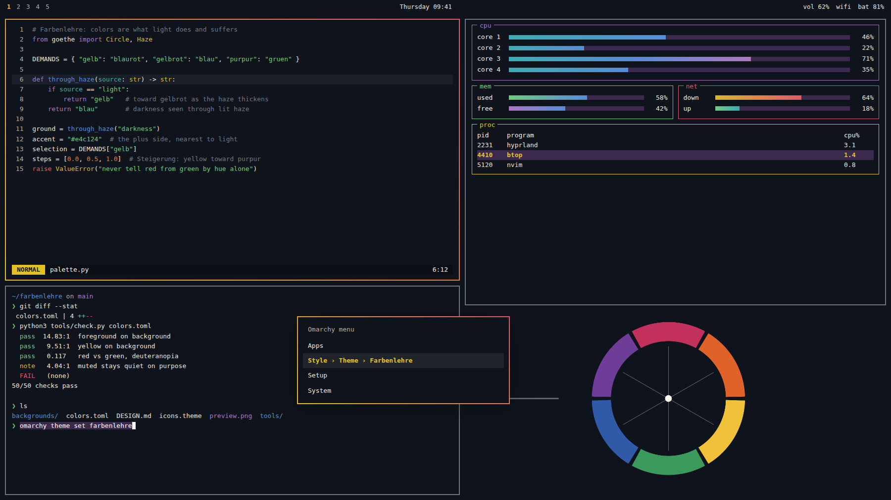

# Farbenlehre

A dark theme for [Omarchy](https://omarchy.org), built on Goethe's *Theory of Colours* (1810).



```sh
omarchy theme install https://github.com/thepixelgardener-create/omarchy-farbenlehre-theme
```

## What makes it different

**Every terminal color is readable.** All twelve signal colors reach at least 5:1 against the background.

**Red and green stay apart for colorblind users.** Green is much brighter than red, so the two never rely on hue alone, and the result is checked with a simulation of red-green color blindness.

**Every color follows Goethe.** Darkness seen through haze turns blue, so the ground is a blue-black. Light seen through haze turns yellow, so the text is warm. Yellow sits on Goethe's plus side, so it is the accent; the eye demands violet after yellow, so the selection is violet. The active window border rises from yellow to red, the intensification Goethe placed at the top of his color circle. [DESIGN.md](DESIGN.md) lists every rule and every measured value.

## Wallpapers

Three wallpapers, drawn in code:

1. **Farbenkreis:** Goethe's six colors, with lines to the color each one demands.
2. **Trübe:** light and darkness seen through haze.
3. **Kanten:** the colored edges a prism shows where light meets darkness.

## Check it yourself

```sh
python3 tools/check.py colors.toml --wallpapers tools/wallpaper-colors.json
python3 tools/wallpapers.py backgrounds
```

The checker needs only Python 3.11 or newer; the wallpaper script needs Pillow.

## Credits and license

The ideas are Goethe's, from *Zur Farbenlehre* (1810), which is in the public domain. Everything in this repository, wallpapers included, is original work under the MIT license.
